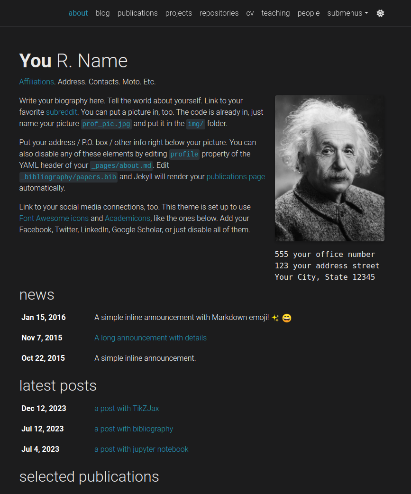
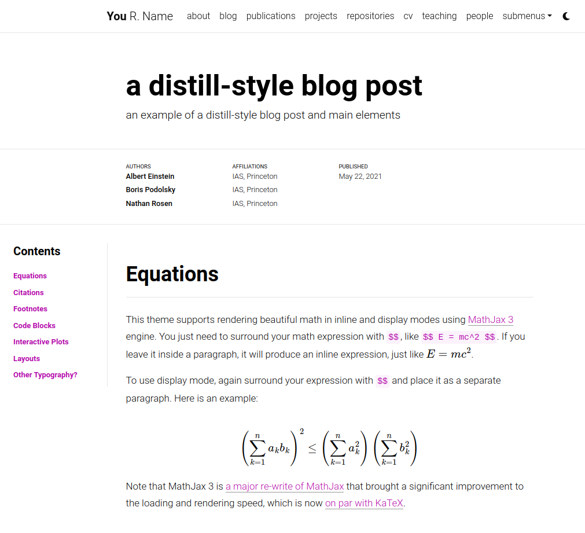

# al-folio

<div align="center">

[](https://alshedivat.github.io/al-folio/)

**Un tema de [Jekyll](https://jekyllrb.com/) simple, limpio y responsivo para académicos.**

---

[](https://github.com/alshedivat/al-folio/actions/workflows/deploy.yml)
[](#maintainers)
[](https://github.com/alshedivat/al-folio/graphs/contributors/)
[](https://hub.docker.com/r/amirpourmand/al-folio)
[](https://hub.docker.com/r/amirpourmand/al-folio)
[](https://hub.docker.com/r/amirpourmand/al-folio)

[](https://github.com/alshedivat/al-folio/releases/latest)
[](https://github.com/alshedivat/al-folio/blob/master/LICENSE)
[](https://github.com/alshedivat/al-folio)
[](https://github.com/alshedivat/al-folio/fork)

</div>

## Comunidad de usuarios

¡La vibrante comunidad de usuarios de **al-folio** está creciendo!
Académicos de todo el mundo utilizan este tema para sus páginas personales, blogs, páginas de laboratorio, así como para cursos, talleres, conferencias, encuentros y más.
Consulta las páginas web de la comunidad a continuación.
No dudes en agregar tus propias página(s) enviando un PR.

<table>
<tr>
<td>Académicos</td>
<td>
<a href="https://martinbulla.github.io" target="_blank">★</a>
<a href="https://maruan.alshedivat.com" target="_blank">★</a>
<a href="https://www.cs.columbia.edu/~chen1ru/" target="_blank">★</a>
<a href="https://maithraraghu.com" target="_blank">★</a>
<a href="https://platanios.org" target="_blank">★</a>
<a href="https://otiliastr.github.io" target="_blank">★</a>
<a href="https://www.maths.dur.ac.uk/~sxwc62/" target="_blank">★</a>
<a href="https://jessachandler.com/" target="_blank">★</a>
<a href="https://mayankm96.github.io/" target="_blank">★</a>
<a href="https://markdean.info/" target="_blank">★</a>
<a href="https://kakodkar.github.io/" target="_blank">★</a>
<a href="https://sahirbhatnagar.com/" target="_blank">★</a>
<a href="https://spd.gr/" target="_blank">★</a>
<a href="https://jay-sarkar.github.io/" target="_blank">★</a>
<a href="https://aborowska.github.io/" target="_blank">★</a>
<a href="https://aditisgh.github.io/" target="_blank">★</a>
<a href="https://alexhaydock.co.uk/" target="_blank">★</a>
<a href="https://alixkeener.net/" target="_blank">★</a>
<a href="https://andreea7b.github.io/" target="_blank">★</a>
<a href="https://rishabhjoshi.github.io/" target="_blank">★</a>
<a href="https://sheelabhadra.github.io/" target="_blank">★</a>
<a href="https://giograno.me/" target="_blank">★</a>
<a href="https://immsrini.github.io/" target="_blank">★</a>
<a href="https://apooladian.github.io/" target="_blank">★</a>
<a href="https://chinmoy-dutta.github.io/" target="_blank">★</a>
<a href="https://liamcli.com/" target="_blank">★</a>
<a href="https://yoonholee.com/" target="_blank">★</a>
<a href="https://zrqiao.github.io/" target="_blank">★</a>
<a href="https://abstractgeek.github.io/" target="_blank">★</a>
<a href="https://www.compphys.de/" target="_blank">★</a>
<a href="https://julianstreyczek.github.io" target="_blank">★</a>
<a href="https://sdaza.com" target="_blank">★</a>
<a href="https://niweera.gq" target="_blank">★</a>
<a href="https://www.alihkw.com" target="_blank">★</a>
<a href="https://amirpourmand.ir" target="_blank">★</a>
<a href="https://scottleechua.github.io" target="_blank">★</a>
<a href="https://sk1y101.github.io" target="_blank">★</a>
<a href="https://yyang768osu.github.io" target="_blank">★</a>
<a href="https://veedata.github.io" target="_blank">★</a>
<a href="https://K-Wu.github.io" target="_blank">★</a>
<a href="https://amalawilson.com" target="_blank">★</a>
<a href="https://tirtharajdash.github.io" target="_blank">★</a>
<a href="https://carolinacarreira.github.io" target="_blank">★</a>
<a href="https://manandey.github.io" target="_blank">★</a>
<a href="https://johanneshoerner.github.io" target="_blank">★</a>
<a href="https://ioannismavromatis.com" target="_blank">★</a>
<a href="https://taidnguyen.github.io" target="_blank">★</a>
<a href="https://lbugnon.github.io" target="_blank">★</a>
<a href="https://joahannes.github.io" target="_blank">★</a>
<a href="https://dominikstrb.github.io" target="_blank">★</a>
<a href="https://tylerbarna.com" target="_blank">★</a>
<a href="https://daviddmc.github.io/" target="_blank">★</a>
<a href="https://andreaskuster.ch/" target="_blank">★</a>
<a href="https://ellisbrown.github.io/" target="_blank">★</a>
<a href="https://noman-bashir.github.io/" target="_blank">★</a>
<a href="https://djherron.github.io/" target="_blank">★</a>
<a href="https://rodosingh.github.io/" target="_blank">★</a>
<a href="https://vdivakar.github.io/" target="_blank">★</a>
<a href="https://george-gca.github.io/" target="_blank">★</a>
<a href="https://bashirkazimi.github.io/" target="_blank">★</a>
<a href="https://dohaison.github.io/" target="_blank">★</a>
<a href="https://raphaaal.github.io/" target="_blank">★</a>
<a href="https://varuniyer.info/" target="_blank">★</a>
<a href="https://yukimasano.github.io/" target="_blank">★</a>
<a href="https://hashe037.github.io/" target="_blank">★</a>
<a href="https://wang-boyu.github.io/" target="_blank">★</a>
<a href="https://qingqingchen.info" target="_blank">★</a>
<a href="https://bajinsheng.github.io/" target="_blank">★</a>
<a href="https://www.silviofanzon.com/" target="_blank">★</a>
<a href="https://kaikaiyao.github.io/" target="_blank">★</a>
<a href="https://alchemz.github.io/" target="_blank">★</a>
<a href="https://samadamday.com/" target="_blank">★</a>
<a href="https://fanpu.io/" target="_blank">★</a>
<a href="https://abigalekim.github.io/" target="_blank">★</a>
<a href="https://lucasresck.github.io/" target="_blank">★</a>
<a href="https://users.wpi.edu/~lfichera/" target="_blank">★</a>
<a href="https://anmspro.github.io/" target="_blank">★</a>
<a href="https://berlyne.net/" target="_blank">★</a>
<a href="https://filippomazzoli.github.io/" target="_blank">★</a>
<a href="https://www.escontrela.me/" target="_blank">★</a>
<a href="https://raffaem.github.io/" target="_blank">★</a>
<a href="https://cbueth.de/" target="_blank">★</a>
<a href="https://kyleaoman.github.io/" target="_blank">★</a>
<a href="https://decwest.github.io/" target="_blank">★</a>
<a href="https://www.jedburkat.com" target="_blank">★</a>
<a href="https://hrzhang.me" target="_blank">★</a>
<a href="https://kudhru.github.io/" target="_blank">★</a>
<a href="https://mbarbetti.github.io/" target="_blank">★</a>
<a href="https://www.zhivotenko.com/" target="_blank">★</a>
<a href="https://giordanodaloisio.github.io/" target="_blank">★</a>
<a href="https://aadityaura.github.io/" target="_blank">★</a>
<a href="https://abhinav-mehta.github.io/" target="_blank">★</a>
<a href="https://shubhashisroydipta.com/" target="_blank">★</a>
<a href="https://astanziola.github.io" target="_blank">★</a>
<a href="https://tinkerer.in" target="_blank">★</a>
<a href="https://sam-bieberich.github.io/" target="_blank">★</a>
<a href="https://afraniomelo.github.io/en/" target="_blank">★</a>
<a href="https://jonaruthardt.github.io" target="_blank">★</a>
<a href="https://www.zla.app/" target="_blank">★</a>
<a href="https://stavros.github.io" target="_blank">★</a>
<a href="https://ericslyman.com" target="_blank">★</a>
<a href="https://ztjona.github.io/" target="_blank">★</a>
<a href="https://chrischoi314.github.io" target="_blank">★</a>
<a href="https://riccobelli.faculty.polimi.it" target="_blank">★</a>
<a href="https://kishanved.tech/" target="_blank">★</a>
<a href="https://abhilesh.github.io/" target="_blank">★</a>
<a href="https://jackjburnett.github.io/" target="_blank">★</a>
<a href="https://physics-morris.github.io/" target="_blank">★</a>
<a href="https://sraf.ir" target="_blank">★</a>
<a href="https://acad.garywei.dev/" target="_blank">★</a>
</td>
</tr>
<tr>
<td>Laboratorios</td>
<td>
<a href="https://www.haylab.caltech.edu/" target="_blank">★</a>
<a href="https://sjkimlab.github.io/" target="_blank">★</a>
<a href="https://systemconsultantgroup.github.io/scg-folio/" target="_blank">★</a>
<a href="https://decisionlab.ucsf.edu/" target="_blank">★</a>
<a href="https://programming-group.com/" target="_blank">★</a>
<a href="https://sailing-lab.github.io/" target="_blank">★</a>
<a href="https://inbt.jhu.edu/epidiagnostics/" target="_blank">★</a>
<a href="https://www.nuesl.org/" target="_blank">★</a>
<a href="https://big-culture.github.io/" target="_blank">★</a>
</td>
</tr>
<tr>
<td>Cursos</td>
<td>
CMU PGM (<a href="https://sailinglab.github.io/pgm-spring-2019/" target="_blank">S-19</a>) <br>
CMU DeepRL (<a href="https://cmudeeprl.github.io/403_website/" target="_blank">S-21</a>, <a href="https://cmudeeprl.github.io/703website_f21/" target="_blank">F-21</a>, <a href="https://cmudeeprl.github.io/403website_s22/" target="_blank">S-22</a>, <a href="https://cmudeeprl.github.io/703website_f22/" target="_blank">F-22</a>, <a href="https://cmudeeprl.github.io/403website_s23/" target="_blank">S-23</a>, <a href="https://cmudeeprl.github.io/703website_f23/" target="_blank">F-23</a>) <br>
CMU MMML (<a href="https://cmu-multicomp-lab.github.io/mmml-course/fall2020/" target="_blank">F-20</a>, <a href="https://cmu-multicomp-lab.github.io/mmml-course/fall2022/" target="_blank">F-22</a>) <br>
CMU AMMML (<a href="https://cmu-multicomp-lab.github.io/adv-mmml-course/spring2022/" target="_blank">S-22</a>, <a href="https://cmu-multicomp-lab.github.io/adv-mmml-course/spring2023/" target="_blank">S-23</a>) <br>
CMU ASI (<a href="https://cmu-multicomp-lab.github.io/asi-course/spring2023/" target="_blank">S-23</a>) <br>
CMU Distributed Systems (<a href="https://andrew.cmu.edu/course/15-440/" target="_blank">S-24</a>)
</td>
</tr>
<tr>
<td>Conferencias y talleres</td>
<td>
ICLR Blog Post Track (<a href="https://iclr-blogposts.github.io/2023/" target="_blank">2023</a>, <a href="https://iclr-blogposts.github.io/2024/about" target="_blank">2024</a>) <br>
ML Retrospectives (NeurIPS: <a href="https://ml-retrospectives.github.io/neurips2019/" target="_blank">2019</a>, <a href="https://ml-retrospectives.github.io/neurips2020/" target="_blank">2020</a>; ICML: <a href="https://ml-retrospectives.github.io/icml2020/" target="_blank">2020</a>) <br>
HAMLETS (NeurIPS: <a href="https://hamlets-workshop.github.io/" target="_blank">2020</a>) <br>
ICBINB (NeurIPS: <a href="https://i-cant-believe-its-not-better.github.io/" target="_blank">2020</a>, <a href="https://i-cant-believe-its-not-better.github.io/neurips2021/" target="_blank">2021</a>) <br>
Neural Compression (ICLR: <a href="https://neuralcompression.github.io/" target="_blank">2021</a>) <br>
Score Based Methods (NeurIPS: <a href="https://score-based-methods-workshop.github.io/" target="_blank">2022</a>)<br>
Images2Symbols (CogSci: <a href="https://images2symbols.github.io/" target="_blank"> 2022</a>) <br>
Medical Robotics Junior Faculty Forum (ISMR: <a href="https://junior-forum-ismr.github.io/" target="_blank"> 2023</a>)<br>
Beyond Vision: Physics meets AI (ICIAP: <a href="https://physicsmeetsai.github.io/beyond-vision/" target="_blank">2023</a>) <br>
Workshop on Diffusion Models (NeurIPS: <a href="https://diffusionworkshop.github.io/" target="_blank">2023</a>)
</td>
</tr>
</table>

## Análisis de PageSpeed de Lighthouse

### Escritorio

[](https://htmlpreview.github.io/?https://github.com/alshedivat/al-folio/blob/master/lighthouse_results/desktop/alshedivat_github_io_al_folio_.html)

Ejecuta la prueba tú mismo: [Google Lighthouse PageSpeed Insights](https://pagespeed.web.dev/report?url=https%3A%2F%2Falshedivat.github.io%2Fal-folio%2F&form_factor=desktop)

### Móvil

[](https://htmlpreview.github.io/?https://github.com/alshedivat/al-folio/blob/master/lighthouse_results/mobile/alshedivat_github_io_al_folio_.html)

Ejecuta la prueba tú mismo: [Google Lighthouse PageSpeed Insights](https://pagespeed.web.dev/report?url=https%3A%2F%2Falshedivat.github.io%2Fal-folio%2F&form_factor=mobile)

## Tabla de contenidos

- [al-folio](#al-folio)
  - [Comunidad de usuarios](#user-community)
  - [Análisis de PageSpeed de Lighthouse](#lighthouse-pagespeed-insights)
    - [Escritorio](#desktop)
    - [Móvil](#mobile)
  - [Tabla de contenidos](#table-of-contents)
  - [Primeros pasos](#getting-started)
  - [Instalación y despliegue](#installing-and-deploying)
  - [Personalización](#customizing)
  - [Características](#features)
    - [Modo claro/oscuro](#lightdark-mode)
    - [CV](#cv)
    - [Personas](#people)
    - [Publicaciones](#publications)
    - [Colecciones](#collections)
    - [Diseños](#layouts)
      - [El estilo icónico de Distill](#the-iconic-style-of-distill)
      - [Compatibilidad total con matemáticas y código](#full-support-for-math--code)
      - [Fotos, audio, video y más](#photos-audio-video-and-more)
    - [Otras características](#other-features)
      - [Repositorios y estadísticas de usuarios de GitHub](#githubs-repositories-and-user-stats)
      - [Tematización](#theming)
      - [Vistas previas en redes sociales](#social-media-previews)
      - [Feed Atom (similar a RSS)](#atom-rss-like-feed)
      - [Entradas relacionadas](#related-posts)
      - [Comprobaciones de calidad del código](#code-quality-checks)
  - [Preguntas frecuentes](#faq)
  - [Contribuciones](#contributing)
    - [Mantenedores](#maintainers)
    - [Todos los colaboradores](#all-contributors)
  - [Historial de estrellas](#star-history)
  - [Licencia](#license)

## Primeros pasos

¿Quieres aprender más sobre Jekyll? Consulta [este tutorial](https://www.taniarascia.com/make-a-static-website-with-jekyll/). ¿Por qué Jekyll? Lee [la entrada del blog de Andrej Karpathy](https://karpathy.github.io/2014/07/01/switching-to-jekyll/)! ¿Por qué escribir un blog? Lee [la entrada del blog de Rachel Thomas](https://medium.com/@racheltho/why-you-yes-you-should-blog-7d2544ac1045).

## Instalación y despliegue

Para obtener detalles sobre la instalación y el despliegue, consulta [INSTALL.md](INSTALL.md).

## Personalización

Para obtener detalles sobre la personalización, consulta [CUSTOMIZE.md](CUSTOMIZE.md).

## Características

### Modo claro/oscuro

Esta plantilla tiene un modo claro/oscuro integrado. Detecta el esquema de color preferido por el usuario y cambia automáticamente a él. También puedes cambiar manualmente entre el modo claro y oscuro haciendo clic en el ícono de sol/luna en la esquina superior derecha de la página.

<p align="center">


</p>

---

### CV

Actualmente, hay 2 formas diferentes de generar el contenido de la página del CV. La primera es utilizando un archivo json ubicado en [assets/json/resume.json](assets/json/resume.json). Es un [estándar conocido](https://jsonresume.org/) para crear un CV de forma programática. La segunda, que actualmente se utiliza como respaldo cuando no se encuentra el archivo json, es mediante un archivo yml ubicado en [\_data/cv.yml](_data/cv.yml). Esta era la forma original de crear el contenido de la página del CV y, dado que es más legible para humanos que un archivo json, decidimos mantenerla como una opción.

Esto significa que, si no hay datos de currículum definidos en [\_config.yml](_config.yml) y cargados a través de un archivo json, se cargarán los contenidos de [\_data/cv.yml](_data/cv.yml) como respaldo.

[](https://alshedivat.github.io/al-folio/cv/)

---

### Personas

Puedes crear una página de personas si deseas destacar a más de una persona. Cada persona puede tener su propia biografía corta, foto de perfil y también puedes configurar si cada persona aparecerá en el mismo lado o en lados opuestos.

[](https://alshedivat.github.io/al-folio/people/)

---

### Publicaciones

Tu página de publicaciones se genera automáticamente desde tu bibliografía BibTeX. Simplemente edita [\_bibliography/papers.bib](_bibliography/papers.bib). También puedes agregar nuevos `*.bib` archivos y personalizar la apariencia de tus publicaciones como desees editando [\_pages/publications.md](_pages/publications.md). De forma predeterminada, las publicaciones se ordenarán por año y las más recientes se mostrarán primero. Puedes cambiar este comportamiento y más en la sección `Jekyll Scholar` del archivo [\_config.yml](_config.yml).

Puedes agregar información adicional a una publicación, como un archivo PDF en el directorio [assets/pdf/](assets/pdf/) y añadir la ruta al archivo PDF en la entrada de BibTeX con el campo `pdf`. Algunos de los campos soportados son: `abstract`, `altmetric`, `arxiv`, `bibtex_show`, `blog`, `code`, `dimensions`, `doi`, `eprint`, `html`, `isbn`, `pdf`, `pmid`, `poster`, `slides`, `supp`, `video` y `website`.

[](https://alshedivat.github.io/al-folio/publications/)

---

### Colecciones

Este tema de Jekyll implementa `collections` (colecciones) para que puedas dividir tu trabajo en categorías. El tema viene con dos colecciones predeterminadas: `news` y `projects`. Los elementos de la colección `news` se muestran automáticamente en la página principal. Los elementos de la colección `projects` se muestran en una cuadrícula responsiva en la página de proyectos.

[](https://alshedivat.github.io/al-folio/projects/)

Puedes crear fácilmente tus propias colecciones, aplicaciones, cuentos, cursos o lo que sea que sea tu trabajo creativo. Para hacerlo, edita las colecciones en el archivo [\_config.yml](_config.yml), crea una carpeta correspondiente y crea una página de aterrizaje para tu colección, similar a `_pages/projects.md`.

---

### Diseños

**al-folio** viene con diseños elegantes para páginas y entradas de blog.

#### El estilo icónico de Distill

El tema te permite crear entradas de blog con el estilo de [distill.pub](https://distill.pub/):

[](https://alshedivat.github.io/al-folio/blog/2021/distill/)

Para más detalles sobre cómo crear entradas con estilo distill utilizando etiquetas `<d-*>`, consulta [el ejemplo](https://alshedivat.github.io/al-folio/blog/2021/distill/).

#### Compatibilidad total con matemáticas y código

**al-folio** admite composición matemática rápida a través de [MathJax](https://www.mathjax.org/) y resaltado de sintaxis de código utilizando el [estilo de GitHub](https://github.com/jwarby/jekyll-pygments-themes). También es compatible con [gráficos chartjs](https://www.chartjs.org/), [diagramas mermaid](https://mermaid-js.github.io/mermaid/#/) y [figuras TikZ](https://tikzjax.com/).

<p align="center">
<a href="https://alshedivat.github.io/al-folio/blog/2015/math/" target="_blank"></a>
<a href="https://alshedivat.github.io/al-folio/blog/2015/code/" target="_blank"></a>
</p>

#### Fotos, audio, video y más

El formato de fotos se simplifica utilizando el [sistema de cuadrícula de Bootstrap](https://getbootstrap.com/docs/4.4/layout/grid/). Crea fácilmente cuadrículas hermosas dentro de tus entradas de blog y páginas de proyectos, con soporte también para incrustaciones de [video](https://alshedivat.github.io/al-folio/blog/2023/videos/) y [audio](https://alshedivat.github.io/al-folio/blog/2023/audios/):

<p align="center">
  <a href="https://alshedivat.github.io/al-folio/projects/1_project/">
    
  </a>
</p>

---

### Otras características

#### Repositorios y estadísticas de usuarios de GitHub

**al-folio** utiliza [github-readme-stats](https://github.com/anuraghazra/github-readme-stats) y [github-profile-trophy](https://github.com/ryo-ma/github-profile-trophy) para mostrar repositorios de GitHub y estadísticas de usuarios en la página `/repositories/`.

[](https://alshedivat.github.io/al-folio/repositories/)

Edita `_data/repositories.yml` y cambia las listas `github_users` y `github_repos` para incluir tu propio perfil y repositorios de GitHub en la página `/repositories/`.

También puedes usar los siguientes códigos para mostrar esto en cualquier otra página.

```html
<!-- code for GitHub users -->

<div class="repositories d-flex flex-wrap flex-md-row flex-column justify-content-between align-items-center">
    
</div>


<!-- code for GitHub trophies -->
  
<h4>{{ user }}</h4>

<div class="repositories d-flex flex-wrap flex-md-row flex-column justify-content-between align-items-center">
  
</div>
 

<!-- code for GitHub repositories -->

<div class="repositories d-flex flex-wrap flex-md-row flex-column justify-content-between align-items-center">
    
</div>

```

---

#### Tematización

Se ha seleccionado una variedad de hermosos colores de tema para que elijas. El predeterminado es morado, pero puedes cambiarlo rápidamente editando la variable `--global-theme-color` en el archivo `_sass/_themes.scss`. Allí también se encuentran otras variables de color. Las opciones de color de tema predeterminadas disponibles se pueden encontrar en [\_sass/\_variables.scss](_sass/_variables.scss). También puedes agregar tus propios colores a este archivo asignándole a cada uno un nombre para facilitar su uso en toda la plantilla.

---

#### Vistas previas en redes sociales

**al-folio** admite imágenes de vista previa en redes sociales. Para habilitar esta funcionalidad, deberás configurar `serve_og_meta` en `true` en tu [\_config.yml](_config.yml). Una vez hecho esto, todas las páginas de tu sitio incluirán datos de Open Graph en el elemento head del HTML.

Luego, deberás configurar qué imagen mostrar en las vistas previas de las redes sociales de tu sitio. Esto se puede configurar página por página, estableciendo la variable de página `og_image`. Si para una página individual esta variable no está establecida, el tema utilizará una variable `og_image` a nivel de sitio, configurable en tu [\_config.yml](_config.yml). En ambos casos, específicos de la página y a nivel de sitio, la variable `og_image` debe contener la URL de la imagen que deseas mostrar en las vistas previas de redes sociales.

---

#### Feed Atom (similar a RSS)

Genera un feed Atom (similar a RSS) de tus entradas, útil para lectores Atom y RSS. El feed es accesible simplemente escribiendo después de tu página principal `/feed.xml`. Por ejemplo, asumiendo que el punto de montaje de tu sitio web es la carpeta principal, puedes escribir `tuusuario.github.io/feed.xml`

---

#### Entradas relacionadas

De forma predeterminada, habrá una sección de entradas relacionadas en la parte inferior de las entradas del blog. Estas se generan seleccionando las entradas más recientes `max_related` que compartan al menos `min_common_tags` etiquetas con la entrada actual. Si no deseas mostrar entradas relacionadas en una entrada específica, simplemente agrega `related_posts: false` al front matter de la entrada. Si deseas deshabilitarlo para todas las entradas, simplemente establece `enabled` en false en la sección `related_blog_posts` en [\_config.yml](_config.yml).

---

#### Comprobaciones de calidad del código

Actualmente, ejecutamos algunas comprobaciones para asegurar que la calidad del código y el sitio generado sean buenas. Las comprobaciones se realizan utilizando GitHub Actions y las siguientes herramientas:

- [Prettier](https://prettier.io/) - verifica si el formato del código sigue la guía de estilo
- [lychee](https://lychee.cli.rs/) - verifica enlaces rotos
- [Axe](https://github.com/dequelabs/axe-core) (debe ejecutarse manualmente) - realiza algunas pruebas de accesibilidad

Decidimos mantener las ejecuciones de `Axe` manuales porque solucionar los problemas no es sencillo y podría ser difícil para personas sin conocimientos de desarrollo web.

## Preguntas frecuentes

Para preguntas frecuentes, consulta [FAQ.md](FAQ.md).

## Contribuciones

¡Las contribuciones a al-folio son muy bienvenidas! Antes de comenzar, échale un vistazo a [las directrices](CONTRIBUTING.md).

Si deseas mejorar la documentación o corregir una pequeña inconsistencia o error, no dudes en enviar un PR directamente a `master`. Para problemas/errores más complejos o solicitudes de funcionalidades, abre un issue utilizando la plantilla correspondiente.

### Mantenedores

Nuestros colaboradores más activos son bienvenidos a unirse al equipo de mantenedores. ¡Si estás interesado, no dudes en contactarnos!

<!-- ALL-CONTRIBUTORS-LIST:START - Do not remove or modify this section -->
<!-- prettier-ignore-start -->
<!-- markdownlint-disable -->
<table>
  <tbody>
    <tr>
      <td align="center" valign="top" width="14.28%"><a href="http://maruan.alshedivat.com"><br /><sub><b>Maruan</b></sub></a></td>
      <td align="center" valign="top" width="14.28%"><a href="http://rohandebsarkar.github.io"><br /><sub><b>Rohan Deb Sarkar</b></sub></a></td>
      <td align="center" valign="top" width="14.28%"><a href="https://amirpourmand.ir"><br /><sub><b>Amir Pourmand</b></sub></a></td>
      <td align="center" valign="top" width="14.28%"><a href="https://george-gca.github.io/"><br /><sub><b>George</b></sub></a></td>
    </tr>
  </tbody>
</table>

<!-- markdownlint-restore -->
<!-- prettier-ignore-end -->

<!-- ALL-CONTRIBUTORS-LIST:END -->

### Todos los colaboradores

<a href="https://contrib.rocks">
  
</a>

## Historial de estrellas

<a href="https://star-history.com/#alshedivat/al-folio&Date">
  <picture>
    <source media="(prefers-color-scheme: dark)" srcset="https://api.star-history.com/svg?repos=alshedivat/al-folio&type=Date&theme=dark" />
    <source media="(prefers-color-scheme: light)" srcset="https://api.star-history.com/svg?repos=alshedivat/al-folio&type=Date" />
    
  </picture>
</a>

## Licencia

El tema está disponible como código abierto bajo los términos de la [Licencia MIT](https://github.com/alshedivat/al-folio/blob/master/LICENSE).

Originalmente, **al-folio** se basaba en el [\*folio theme](https://github.com/bogoli/-folio) (publicado por [Lia Bogoev](https://liabogoev.com) y bajo la licencia MIT). Desde entonces, se ha realizado una reescritura completa de los estilos y se han añadido muchas características adicionales.
